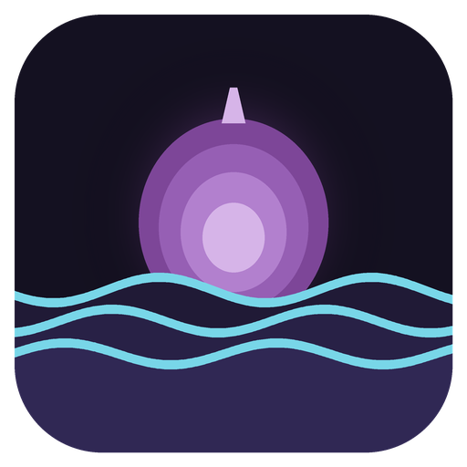
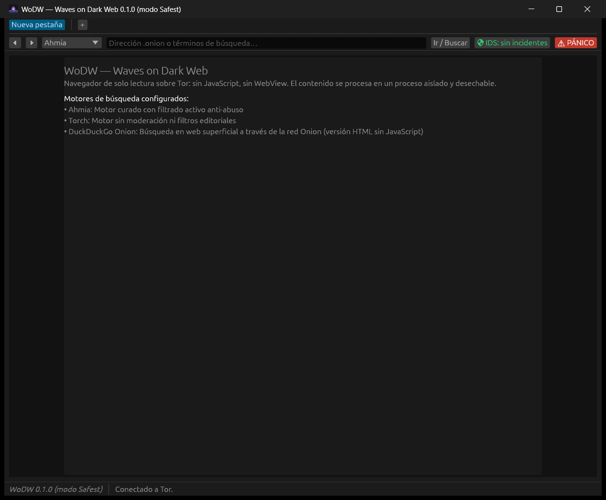

<p align="center">
  
</p>

# WoDW — Waves on Dark Web

Navegador de escritorio de **solo lectura** para la red Tor, escrito en Rust, para Windows y
Linux/Tails. Lleva Tor dentro, no ejecuta nada de lo que descarga y abre cada página en un proceso
aparte, encerrado y de usar y tirar. Si detecta un ataque, reacciona solo.

## Sobre Celtilander

Soy un usuario novel en el mundo de la programación y la IA. He «ayudado a crear» esta app y
espero que a alguien le pueda servir para algo... sin más.

Lo que no funciona no lo escondo: está escrito en
[defectos conocidos](documentacion/defectos-conocidos.md). Si encuentras algo que no esté ahí,
cuéntamelo.

Para realizar esta app he montado un sistema colaborativo y de consenso entre ChatGPT Codex,
Claude Code y Gemini Antigravity. Yo puse la idea y dirigía el proyecto, mientras que ellos
diseñaban, repartían y verificaban el trabajo. Ningún código fue revisado por el agente que lo
había escrito, y una vez terminado todo debía ser aprobado por unanimidad. Hasta que no se
conseguía el consenso, no se daba una tarea por concluida. Cuando por algún motivo no se llegaba
a un consenso, era yo quien tomaba la decisión final, así que los fallos que pueda haber serán
más míos que de ellos.

Saludos a todo el mundo.

## El problema que resuelve

Un navegador normal es un programa enorme que ejecuta código de cualquier sitio que visitas:
JavaScript, decodificadores de imagen, vídeo, tipos de letra. En la red Tor hay sitios que buscan
justo eso, un fallo en alguna de esas piezas para salir del navegador y llegar a tu equipo o
descubrir quién eres.

WoDW renuncia a casi todo a cambio de seguridad. No ejecuta JavaScript ni nada que venga de la
página. Muestra texto, enlaces, imágenes, audio y vídeo, pero nunca tal como llegan: todo se abre
dentro de una jaula sin red de la que no se puede salir, y de allí solo sale reconstruido desde
cero (letras limpias, píxeles nuevos, sonido nuevo).

## Cómo se ve

<p align="center">
  
</p>

La ventana recién abierta y ya **conectada a Tor** (abajo a la izquierda). Arriba están las
pestañas y la barra de navegación: atrás y adelante, el **selector de buscador**, la barra donde
escribir una dirección `.onion` o unas palabras, el indicador verde del **IDS**, que abre el panel defensivo, y el botón rojo del **pánico**, que borra todo y
cierra la aplicación. Si dejas el ratón quieto sobre él, una viñeta te avisa de lo que hace.

## Qué hace

WoDW navega por Tor sin que tengas que instalar Tor: lo lleva dentro, gracias a `arti-client`, la
implementación en Rust del propio Proyecto Tor. No abre puertos en tu equipo y nunca pregunta al
DNS del sistema. Cada pestaña sale por sus propios circuitos, así que un sitio no puede relacionar
lo que haces en dos pestañas distintas. Para buscar trae cinco buscadores, cada uno con su
fiabilidad a la vista: Ahmia, DuckDuckGo Onion, OnionLand y VormWeb, cuyas direcciones confirma una
fuente oficial, y Tor66, que no está verificado y lo indica. El botón «Accesos» lleva con un clic a
directorios que dicen qué sitios son auténticos, como dark.fail y tor.taxi. Puedes añadir los tuyos,
y WoDW rechaza cualquier dirección `.onion` mal escrita.

Muestra texto, imágenes, audio y vídeo, pero siempre reconstruidos. Al texto se le quitan los
caracteres invisibles y los trucos que invierten la dirección de la escritura, se normaliza, y si
un enlace dice ir a un sitio pero lleva a otro, WoDW te avisa. Trae fuentes para leer alfabetos de
todo el mundo: latino, cirílico, griego, árabe, chino, japonés, coreano y más. Las imágenes (PNG,
JPEG, GIF, WebP, BMP, TIFF, ICO, QOI y AVIF, hasta 4K) se rehacen píxel a píxel y pierden todos sus
metadatos. El audio (MP3, OGG/Vorbis, Opus, FLAC, WAV y AAC/M4A) se convierte siempre a 48 kHz,
sin ultrasonidos y con un limitador que impide picos de volumen dañinos. Del vídeo (MP4 con H.264 y
WebM con AV1, hasta 4K) se vuelve a dibujar cada fotograma desde sus píxeles y el sonido pasa por
el mismo filtro, así que del archivo no sale nada más: ni metadatos, ni subtítulos, ni pistas
ocultas. Nada suena ni se descarga por su cuenta: las imágenes, audios y vídeos de una página se
listan y solo se abren cuando los pulsas. Ejecutables y documentos, ni eso.

La aplicación se defiende sola. Bloquea los sitios que envían cosas hostiles, cambia de circuitos,
borra la pestaña afectada y, si detecta un compromiso grave, lo borra todo y se cierra. Tampoco deja
rastro: borra pestañas e historial tras 30 minutos sin uso y al cerrar, y ni siquiera un cierre
brusco deja volcados de memoria en el disco.

Si lo necesitas, puedes activar un registro de la sesión: tú eliges si apunta solo lo relacionado
con la seguridad o todo, y si se guarda solo o cuando lo pides, y cada opción te explica sus
consecuencias. Al abrirse, WoDW consulta GitHub a través de Tor y te avisa si hay una versión nueva,
sin descargar nunca nada. Con puentes obfs4 o Snowflake puedes ocultar a tu proveedor de internet
que usas Tor. Y es portable: no necesita instalación.

## Cómo lo hace

**Dos papeles, un ejecutable.** El proceso que ves (el *Maestro*) lleva la ventana, Tor y el
detector de incidentes. Cuando descarga algo, no lo abre él: lanza una copia de sí mismo en modo
*Worker*, que se encierra, procesa ese único recurso, devuelve texto limpio, píxeles o sonido y
muere. Hay un Worker nuevo para cada página, imagen, audio o vídeo. Si un archivo malicioso consigue
engañar al decodificador, se queda atrapado en un proceso sin red, con la memoria limitada y que
morirá en cuanto termine.

**La jaula.** Antes de leer un solo byte de fuera, el Worker se encierra. En **Linux y Tails** lo
hace con Landlock, que le quita el acceso al disco y a la red, y con dos filtros seccomp: uno lo
mata si intenta abrir conexiones, ejecutar programas o espiar otros procesos, y el otro le impide
crear procesos. Además, muere si muere el Maestro. En **Windows** vive dentro de un **AppContainer
sin permisos**, que le impide abrir cualquier conexión de red, ni siquiera local; tiene activadas
las mitigaciones del sistema (sin procesos hijo, sin código generado al vuelo, solo bibliotecas
firmadas por Microsoft) y está dentro de un Job Object que limita su memoria y lo mata si se cierra
el Maestro.

**Desconfianza a cada paso.** El cliente HTTP pone plazo a cada lectura, limita el tamaño de todo y
rechaza las respuestas ambiguas o con caracteres colados. Cada archivo se identifica por su
contenido, no por lo que dice el servidor; su estructura se revisa antes de entregarlo a ningún
decodificador; y su tamaño en píxeles se mide antes de abrirlo, para frenar las «bombas» que ocupan
gigas al descomprimirse. Solo se admite una lista cerrada de formatos, casi todos con decodificador
escrito en Rust. Y el Maestro vuelve a comprobar todo lo que le devuelve el Worker: tampoco se fía
de él.

**Respuesta automática.** Un detector de incidentes (IDS) clasifica lo que pasa por gravedad y
actúa sin preguntarte. Si el Worker intenta salir de su jaula, o algún señuelo en disco o en
memoria aparece tocado, salta el **pánico**: se sobrescribe con ceros todo lo que hay en memoria de
la sesión y la aplicación se cierra al instante.

Todos los detalles están en la [arquitectura](documentacion/arquitectura.md).

## Lo que no hace

WoDW no ejecuta JavaScript, así que muchas webs modernas no se verán bien o directamente no
funcionarán. Tampoco abre documentos, como PDF u Office, ni ningún formato fuera de su lista
cerrada; por ejemplo, los vídeos VP8, VP9 u Ogg Theora no se reproducen. En árabe, persa y jemer
las letras se ven, pero sueltas, sin unirse ni reordenarse como lo haría un navegador corriente.

Y no te hace invisible: si inicias sesión con tu nombre o das datos personales, ningún programa
puede protegerte de eso. El resto de limitaciones técnicas conocidas están en
[defectos conocidos](documentacion/defectos-conocidos.md).

## Usarla

En [Releases](https://github.com/celtidcs/WoDW/releases) hay dos descargas:

- **Windows** (10 u 11, 64 bits): `wodw-0.2.1-windows-x86_64.zip`. Descomprímelo y abre `wodw.exe`;
  no se instala. Dentro van dos ejecutables, `wodw.exe` y `wodw-worker.exe` (el proceso aislado que
  abre cada página): tienen que estar juntos en la misma carpeta.
- **Linux** (64 bits): `wodw-0.2.1-linux-x86_64.tar.gz`. Descomprímelo y ejecuta `./wodw`. Necesita
  glibc 2.39 o posterior, OpenSSL 3 y la biblioteca de sonido ALSA (`libasound2`), es decir,
  Debian 13, Ubuntu 24.04, Tails 7 o más recientes. En distribuciones más antiguas, compílalo tú
  (abajo se explica cómo).

`SHA256SUMS.txt` trae las huellas de cada archivo para comprobar que la descarga está íntegra.

La barra de abajo te dirá cuándo está conectado a Tor. Cómo navegar, qué hace sola y cómo
configurarla está en el [manual de uso](documentacion/manual-de-uso.md). Para ajustar algo, copia
`wodw.ejemplo.toml` como `wodw.toml` junto al ejecutable: cada opción está explicada dentro.

## Compilar y ejecutar

Necesitas [Rust](https://rustup.rs) estable. En Windows, además, Visual Studio Build Tools con
«Desarrollo para el escritorio con C++» (también compila el decodificador H.264). En Linux, un
compilador de C y las bibliotecas de la [lista de requisitos](documentacion/infraestructura/requisitos.md),
entre ellas las de sonido ALSA (`libasound2-dev` en Debian y Ubuntu).

```bash
git clone https://github.com/celtidcs/WoDW.git
cd WoDW
cargo build --release
```

Los dos ejecutables quedan en `target/release/`: `wodw` y `wodw-worker` (con `.exe` en Windows),
que tienen que ir juntos. Para comprobar que todo está bien:

```bash
cargo test --all-features
cargo clippy --all-targets --all-features -- -D warnings
cargo fmt --check
cargo audit
```

La [guía de clonado](documentacion/infraestructura/guia-de-clonado.md) lo explica paso a paso, con
scripts que preparan el entorno en Windows y en Linux.

## Documentación

- [Funcionalidades](documentacion/funcionalidades.md)
- [Manual de uso](documentacion/manual-de-uso.md)
- [Arquitectura](documentacion/arquitectura.md)
- [Defectos conocidos](documentacion/defectos-conocidos.md)
- [Historial de cambios](documentacion/historial-de-cambios.md)
- [Infraestructura](documentacion/infraestructura/vision-general.md)

## Estado del proyecto

Versión **0.2.1**. Comprueba que las direcciones `.onion` estén bien escritas, indica la fiabilidad de
cada buscador, añade accesos directos y, en Windows, ya no abre una terminal. La 0.2.0 fue la primera
que reproduce audio y vídeo, y corrigió un fallo de seguridad importante de la 0.1.0: en Windows, el botón del pánico dejaba en el disco una copia de la memoria
de la sesión (en los [defectos conocidos](documentacion/defectos-conocidos.md) se explica cómo
borrarla). Probada en Windows 11 y en Linux (Debian 13), también navegando de verdad por servicios
onion. En Tails todavía no se ha probado.

Hay un detalle temporal: Arti 0.47 se bloquea al arrancar en Windows por un fallo en una de sus
dependencias, ya reportado a sus desarrolladores. Mientras lo corrigen, WoDW incluye una copia
arreglada de esa pieza en `parches/saturating-time/`. Se quitará en cuanto salga la versión
corregida de Arti.

Los problemas se reportan y siguen como [issues](https://github.com/celtidcs/WoDW/issues) de
GitHub.

## Licencia

**GPL-3.0 o posterior.** El texto íntegro está en [`LICENSE`](LICENSE).

En corto: puedes usar el programa para lo que quieras, estudiar cómo funciona, modificarlo y
repartirlo. La única condición es que **si repartes una versión modificada, publiques también su
código**, con esta misma licencia.

Se eligió copyleft y no una licencia permisiva a propósito. Un navegador que promete proteger a
quien lo usa solo merece confianza si cualquiera puede leer su código y comprobar que hace lo que
dice; una versión cerrada no podría demostrarlo. Lo que se construya encima vuelve a todos.

La copia de `saturating-time` incluida en `parches/` conserva su licencia original (MIT o
Apache-2.0), compatible con la GPL. Las fuentes de `recursos/fuentes/` conservan las suyas (SIL Open
Font License 1.1 y Apache-2.0), cuyos textos van junto a ellas.

El vídeo H.264 se decodifica con OpenH264 de Cisco, compilado desde su código fuente (licencia
BSD-2). H.264 está sujeto a patentes en algunos países; la licencia de patentes que Cisco cubre se
aplica solo a los binarios que distribuye la propia Cisco, no a este decodificador compilado aquí.

Se entrega **sin ninguna garantía**, como dice la licencia.
